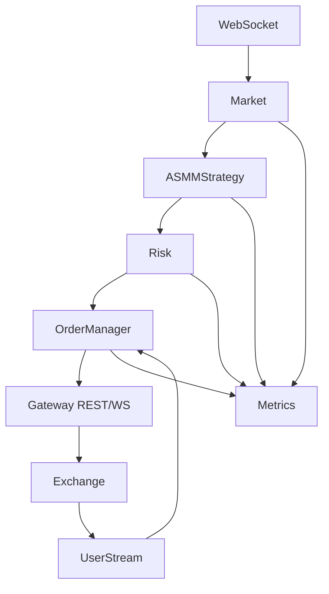

# 架构与系统总体构想（Architecture & System Plan）

本说明定义系统组件、数据流与演进路径，作为架构级的统一视图。

## 1. 系统组件
- 市场数据层（market）：深度/成交聚合、波动率、Imbalance、Regime、VPIN；输出 `Snapshot`。
- 策略层（strategy/asmm）：基于 `Snapshot` 与 `inventory` 输出多档 `Quote`；含库存偏移、Regime/VPIN 自适应。
- 风控层（risk）：组合守卫（限额/延迟/PnL），自适应风险管理（联动 posttrade 与市场状态）。
- 订单层（order）：对接网关提交/撤单，状态机校验，精度/名义约束；维护活跃挂单集合。
- 网关层（gateway）：REST/WS/ListenKey 客户端，心跳与重连，限流与重试。
- Runner（sim/runner）：将上述组件编排为可运行流程，负责差分下发/降级/陈旧度回退。
- 监控层（metrics/monitoring）：Prometheus 指标与日志规范，Grafana 面板。

## 2. 数据流（行情 → 策略 → 风控 → 下单 → 反馈）

## 3. 关键路径与约束
- 行情陈旧度：以 WS 为主，超过阈值回退 REST，以 `Runner.ReadyForNext` 控制频率。
- 差分下发：维护每档状态，只有超过阈值才撤改；减少限速风险与逆选择成本。
- Risk/Reduce-only：库存/市场状态驱动只减仓/冷却；PostOnly 拒单自动降级。

## 4. 策略自适应与事后学习
- `posttrade.Analyzer` 统计 1s/5s 后价格走势与逆向选择率；
- `risk.Adaptive` 根据 `AdverseSelectionRate` 与 Regime/VPIN 调整 `NetMax/BaseSize/MinSpreadBps`；
- 在 `ASMMStrategy` 与 Runner 中以指标反映（`mm_adverse_selection_rate/mm_adaptive_netmax`）。

## 5. 配置驱动
- 每个 `symbols.<sym>` 独立配置策略与风控；Runner 仅保留基础开关（`-symbol`、`-dryRun` 等）。
- 单位与精度统一：Bps/百分比；`tickSize/stepSize/minNotional` 严格对齐交易所参数。

## 6. 监控与运维
- 指标分层：Runner/市场/策略/风控；关键事件 JSON 日志；
- Grafana：spread/quote interval/risk state/REST/WS 错误与重连；
- Alertmanager：风险状态（>0）、ListenKey 失败、REST 错误率阈值。

## 7. 演进路线（与 TODO 对齐）
- P0：ASMM 多档 + Imbalance/Regime + 生命周期修复 + 单位与指标统一；
- P1：VPIN/Toxic 与策略保守化；PostTrade + AdaptiveRisk 闭环；
- P2：网关健壮化与联机稳定性；打包与部署流程。

## 8. 风险与边界
- 交易所限速与拒单：通过差分与降级抑制；
- 行情质量：陈旧与缺失时进入保守状态（Reduce-only/Halt）；
- 监控偏移：指标名与事件字段统一由常量管理。
