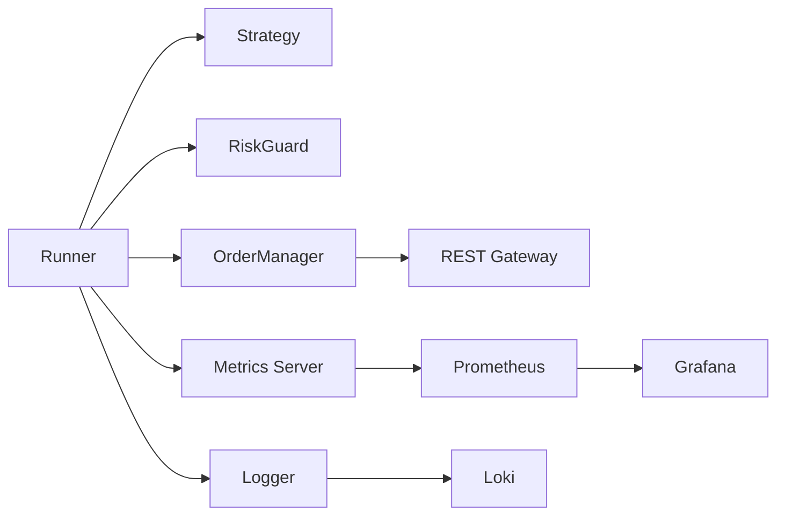

# 市场做市工程（Round7阶段）阶段性总结与技术说明

> 版本：v0.7（Round7），文档归档于 reports/
> 范围：整体概述、架构、策略、风控、主要参数、接口、监控与运维、演进与优化建议

本工程自初始原型起，已迭代至 Round7 阶段：完成几何网格策略、浮亏分层减仓、净仓硬帽等关键风控改造，并配套完善 Prometheus/Grafana/Loki 监控与一键运维脚本，形成可复用的单实例实盘流程与阶段性报告机制。本文档对当前阶段的整体技术形态进行系统性总结，作为工程里程碑材料与后续演进参考。

---

## 1. 概述（Overview）

- 目标：以轻量、透明、可回溯的工程形态，构建面向 USDC 计价永续合约的做市系统，支持小额资金（如 200 USDC）在受控风险下进行活跃报价与库存管理。
- 当前进度（Round7）：
  - 策略：采用“几何加宽网格 + 动量微调 + 库存压力偏斜”的组合，并引入“浮亏分层减仓”的动作管理。
  - 风控：实现“净仓硬帽（pre-trade cap）”、“单次/当日风险阈值”、“Reduce-Only 自动收敛”与“冲击检测（shock）”等；在策略层与下单层均有防线。
  - 监控：统一以 `mm_*` 指标体系暴露核心运行态（价格、仓位、PNL、订单统计、REST 请求/延迟等），Grafana 综合面板可视化；Loki/Promtail 集成日志。
  - 运维：提供单实例 4 小时实盘的规范脚本（启动/定时收尾/自动报告）、紧急停车与清仓脚本，降低“影子进程”风险。

---

## 2. 整体架构（Architecture）

工程被组织为可清晰分层的模块：行情与状态、策略与风控、订单与网关、指标与日志、脚本与运维。

- Runner（`cmd/runner/main.go`）
  - 行情驱动循环，协调策略计算与风控校验，执行下单/撤单，更新监控指标。
  - 关键调用：`metrics.StartMetricsServer`、`metrics.UpdateStrategyMetrics`、`metrics.UpdateMarketData` 等。
- Strategy（`strategy/asmm/`）
  - ASMM（Adaptive Skewed Market Making）为核心做市逻辑，整合几何层级与动量、库存压力偏斜、保留价等；核心输出为多档双边报价与层级参数。
  - 关键符号：`reservationPrice`、`skewFactor`、`adaptiveNetMax` 等（以 `UpdateStrategyMetrics` 上报）。
- RiskGuard（策略前置与下单前置）
  - 在生成报价与落单前进行硬帽判定与阈值校验（如净仓 + 下单 size 不得超过 `netMax`），并在订单回报后进行 Reduce-Only 收敛动作。
- OrderManager（`order/`）
  - 维护活跃订单、状态机与事件回调；提供活跃订单查询等接口（如 `GetActiveOrders()`）。
- Gateway（`cmd/...` 自研 REST 封装）
  - 以 REST 接口与交易所交互（下单、撤单、查询）；对请求与延迟进行指标化与日志化。
- Metrics（`metrics/prometheus.go`）
  - 统一注册并更新 `mm_*` 指标，用于在 Prometheus/Grafana 上呈现关键运行数据。
- Logging（Loki/Promtail）
  - 采集 runner 行为日志（如 `[strategy_adjust]`、`[order_update]`）到 Loki，配合 Grafana 进行检索与事件追踪。
- Scripts（`scripts/`）
  - 提供标准实盘启动、定时收尾与报告生成；同时提供紧急停车与清仓脚本以保障安全退出。

---

## 3. 策略说明（Strategy）

当前策略采取“几何加宽网格”为基础的分层做市框架，并整合库存压力、动量信号与保留价偏移，实现稳健的双边报价与分层补/减仓。

- 几何层级（Round7 核心）
  - `layerSpacingMode: geometric`、`spacingRatio: 1.20`：相邻层级以固定比率扩展价距，使远层更稀疏、更抗单边行情。
  - `layerSizeDecay: 0.90`：层级数量衰减，越远的报价 size 越小，降低尾部风险。
  - `maxLayers: 24`：足够的层数以应对中等强度的单边与震荡。
- 动量与压力
  - `momentumThreshold: 0.0006`、`momentumAlpha: 0.08`：微调动量对价差/间距的影响，抑制追涨杀跌；
  - `inventoryPressureThreshold: 0.4`、`inventoryPressureStrength: 0.5`、`inventoryPressureExponent: 2.5`：高库存时增加价差或偏斜，抑制方向性敞口继续扩大。
- 做市基础参数
  - `minSpread: 0.0006`：最小价差（含 `feeBuffer: 0.0002`）确保手续费覆盖与滑点冗余；
  - `baseSize: 0.009`：基础下单手数（结合 `stepSize: 0.001` 校验）；
  - `quoteIntervalMs: 500`：报价刷新间隔（0.5s），兼顾实时性与 REST 频率限制；
  - `takeProfitPct: 0.0025`：局部止盈阈值，用于获利了结与库存回缩。
- 保留价与偏斜
  - 策略中计算 `reservationPrice`（保留价）结合 `skewFactor`（库存偏斜），实现双边档位的对称/非对称调整。

---

## 4. 风控体系（Risk Controls）

风控覆盖“策略前置、下单前置、事后收敛与停止”全流程，形成多道防线：

- 净仓硬帽（Pre-trade Net Cap）
  - `netMax: 0.21`：在生成/执行订单前以“净仓 + 下单 size”进行硬校验，超过即拒单；有效防止库存失控。
- 订单与当日限额
  - `singleMax: 0.06`：单笔上限；`dailyMax: 50.0`：当日风险预算；`latencyMs: 150`：交易延迟阈值提示。
- PnL 与停机阈值
  - `pnlMin: -15.0`、`pnlMax: 100.0`：区间超出触发保护措施；`stopLoss: -60.0`：严重亏损强制停止；`haltSeconds: 300`：停机冷却时间。
- Reduce-Only 收敛与滑点约束
  - `reduceOnlyThreshold: 25.0`：触发收敛的盈亏阈值；
  - `reduceOnlyMaxSlippagePct: 0.0003`、`reduceOnlyMarketTriggerPct: 0.15`：收敛时的滑点与市价触发控制，避免因强制平仓引发过度成本。
- 浮亏分层减仓（Drawdown Bands）
  - `drawdownBands: [5, 8, 12]` 与 `reduceFractions: [0.15, 0.25, 0.40]`：当浮亏进入多档阈值时，按分数进行分层减仓；
  - `reduceMode: maker_first_then_taker`：优先用挂单方式减仓，必要时以市价完成收敛；
  - `reduceCooldownSeconds: 120`：减仓动作的冷却期，防止频繁操作导致费用堆积与噪声。
- 冲击与停机（Shock & Halt）
  - `shockPct: 0.10`：极端价格变动时进行保护动作；与停机阈值协同。

在系统层，风控指标同步以 `mm_*` 上报，Grafana 面板可实时观察“净仓与 PnL、订单拒绝/执行比率、REST 错误与延迟”等状态。

---

## 5. 主要参数与交易所约束（Key Params）

符号信息（`ETHUSDC`）：
- `tickSize: 0.01`、`stepSize: 0.001`：价格与数量粒度；
- `minQty: 0.001`、`maxQty: 1000`、`minNotional: 10`：交易所最小/最大与名义金额约束；

策略参数（核心）：
- 价差与成本：`minSpread: 0.0006`、`feeBuffer: 0.0002`
- 手数与节奏：`baseSize: 0.009`、`quoteIntervalMs: 500`、`takeProfitPct: 0.0025`
- 几何层级：`layerSpacingMode: geometric`、`spacingRatio: 1.20`、`layerSizeDecay: 0.90`、`maxLayers: 24`
- 信号与压力：`inventoryPressure*`、`momentum*`（含阈值与强度/指数）

风控参数（核心）：
- 库存与频次：`netMax: 0.21`、`singleMax: 0.06`、`dailyMax: 50.0`
- PnL 与停机：`pnlMin/pnlMax/stopLoss/haltSeconds`、`shockPct`
- 收敛与滑点：`reduceOnlyThreshold`、`reduceOnlyMaxSlippagePct`、`reduceOnlyMarketTriggerPct`、`reduceCooldownSeconds`

网关配置（`gateway`）：
- `apiKey`/`apiSecret`（敏感信息不在文档展示）；`baseURL: https://fapi.binance.com`

---

## 6. 内外部接口（Interfaces）

- 交易所交互（REST Gateway）
  - 下单、撤单、仓位与余额查询；所有请求均记录请求计数、错误计数与延迟直方图。
  - 关键更新：
    - 下单计数：`mm_orders_placed_count{symbol,side}`（在下单逻辑中调用）；
    - 撤单计数：`mm_orders_canceled_count{symbol}`（在撤单或订单回报中上报）；
    - 成交计数：`mm_total_fills{symbol,side}`（订单回报回调中根据 `BUY/SELL` 侧累加）。
- 策略接口（Strategy）
  - `UpdateStrategyMetrics(reservationPrice, skewBps, adaptiveNetMax)`：用于将当前策略关键态上报到指标；
  - `mm_spread_gauge{symbol}`、`mm_quote_interval_gauge{symbol}`：在策略参数调整时更新（如 `[strategy_adjust]` 日志事件）。
- 风控接口（Risk）
  - Pre-trade 检查：在 `Runner` 的主循环内对净仓与下单 size 判定；超限拒单并记录事件。
  - Post-trade 收敛：订单回报触发时，根据浮亏档位判定是否触发 `Reduce-Only` 动作。
- 监控接口（Metrics/Logging）
  - `mm_mid_price/mm_bid_price/mm_ask_price`：行情数据；
  - `mm_position/mm_entry_price/mm_unrealized_pnl/mm_realized_pnl`：仓位与盈亏；
  - `mm_active_orders{side}`：活跃买/卖单数量；
  - REST 指标：`mm_rest_requests_total/mm_rest_errors_total/mm_rest_latency_seconds`；
  - 行为日志：`[order_update]`、`[strategy_adjust]` 等事件可在 Loki 检索。

---

## 7. 技术框架与组件（Tech Stack）

- 语言与运行时：Go（Linux 环境）
- 市场数据与交易：Binance 永续（USDC 合约），REST 交互
- 监控链路：Prometheus（指标抓取）+ Grafana（仪表盘）+ Loki/Promtail（日志）
- 运维与脚本：Bash 脚本管理单实例实盘、定时器、紧急停车与报告生成

关键工程文件与符号：
- Runner：`cmd/runner/main.go`（主循环、指标更新、订单回调）
- 策略：`strategy/asmm/strategy.go`（保留价、库存偏斜、动量与层级生成；`UpdateStrategyMetrics` 上报）
- 指标：`metrics/prometheus.go`（`mm_*` 指标注册与更新 helper，如 `UpdateMarketData`、`UpdatePositionMetrics`、`UpdateOrderMetrics`）
- 订单与状态：`order/`（`GetActiveOrders()`、订单状态枚举与回调）
- 配置：`configs/config_round7_geometric_drawdown.yaml`（策略与风控参数）
- 脚本：
  - `scripts/run_round7_4h.sh`：单实例 4 小时实盘（清场、初始化快照、启动 runner、定时收尾）
  - `scripts/finish_round7_4h.sh`：定时收尾（停止、清仓撤单、抓 metrics、生成报告）
  - `scripts/emergency_stop.sh`：紧急停车并 Reduce-Only 清仓
  - 工具命令：`cmd/binance_panic`、`cmd/binance_position`

---

## 8. 监控与仪表盘（Monitoring & Dashboards）

统一采用 `mm_*` 指标体系，保证 Grafana 综合面板的可读性与完整性：

- 行情与仓位：
  - `mm_mid_price/mm_bid_price/mm_ask_price`：显示市场价格曲线
  - `mm_position/mm_entry_price`：净仓与入场均价
  - `mm_unrealized_pnl/mm_realized_pnl`：浮盈亏与已实现盈亏
- 订单统计与活跃度：
  - `mm_active_orders{side}`：活跃买/卖单数量
  - `mm_total_fills{side}`：按侧累计成交次数
  - `mm_orders_placed_count{side}`：按侧下单计数
  - `mm_orders_canceled_count`：撤单计数
- 策略与节奏：
  - `mm_spread_gauge{symbol}`：当前价差（bps）
  - `mm_quote_interval_gauge{symbol}`：报价间隔（秒）
  - `mm_reservation_price/mm_inventory_skew_bps/mm_adaptive_netmax`：策略态
- REST 健康度：
  - `mm_rest_requests_total/mm_rest_errors_total/mm_rest_latency_seconds`：请求/错误/延迟直方图
- 运营建议：
  - 保留“核心运行指标”作为面板顶部；将旧版 `Trader Dashboard`（使用 `runner_*`）标记为废弃，避免误读。

---

## 9. 运行与运维流程（Ops）

- 单实例启动（4h）：
  - `scripts/run_round7_4h.sh`
    - 步骤：清场（杀旧 runner/脚本）→ 初始快照（余额/仓位/中间价）→ 启动 runner（记录 PID）→ 启动定时器（4h 后自动收尾）→ 日志与指标就绪
    - 约束：端口 `:8080` 供 Metrics Server；严格 PID 管理，杜绝“影子 runner”。
- 定时收尾：
  - `scripts/finish_round7_4h.sh`
    - 步骤：停止 runner → 撤单与 Reduce-Only 清仓 → 抓取 metrics 与日志尾部 → 生成报告 `reports/round7_4h_test_report.md`
- 紧急停车：
  - `scripts/emergency_stop.sh`
    - 用法：`CONFIG_PATH=... SYMBOL=ETHUSDC FLATTEN=true bash scripts/emergency_stop.sh`
    - 功能：停止本地进程、撤销全部委托、Reduce-Only 市价平仓，并校验真实仓位为 0。
- 风险提示：
  - 若 UI 侧仍显示仓位或委托，优先通过 `cmd/binance_position` 与交易所核验；确认无影子 runner 后再刷新 UI。

---

## 10. 阶段性结论（Round7）

- 设计目标达成度：
  - 做市活跃度：在 0.5s 报价节奏下，买卖两侧下单与成交频率合理，未出现“长期沉寂”；
  - 库存控制：`netMax: 0.21` 的硬帽在多次加仓尝试中成功拒单，库存未失控；
  - 收敛与减仓：浮亏档位与 Reduce-Only 机制在必要场景下可触发，长尾风险可控；
  - 监控可用性：核心 `mm_*` 指标已在面板首屏呈现价格/仓位/PNL/订单，显著提升可读性与调试效率。
- 主要问题与改进：
  - 影子 runner：此前存在多实例进程并行下单，导致清仓后仍继续开单；现阶段已通过“清场+PID 管理”与定时收尾脚本治理。
  - 定时器精度：需要更稳健的退出标记（PID 文件 + 锁文件），防止误杀与漏杀；建议引入“单实例文件锁”。
  - 策略细化：可进一步基于波动状态（Volatility Regime）自适应层数与价差，增强低/高波动下的鲁棒性。
  - 成本与滑点：在 Reduce-Only 场景下增加滑点监测与事后评估（按成交均价与市价差），优化止损/收敛成本。

---

## 11. 未来演进与优化建议（Roadmap）

- 策略层：
  - 引入更精细的成交型动量（如 VPIN）与 LOB 不对称特征，动态调节 `maxLayers/spacingRatio`；
  - 增强保留价估计：结合短期波动率与不对称成交压力，提升 `reservationPrice` 的稳健性。
- 风控层：
  - 订单拒绝统计与回放：增加拒单原因（净仓硬帽/阈值/滑点）分类计数，用于面板诊断；
  - 多级“降噪”开关：在高错误率或高延迟时自动降低报价频率与层数。
- 监控层：
  - 报告自动化：将阶段性报告（PNL、库存、成交/撤单、REST 错误与延迟分布）以模板化生成；
  - 告警：为关键阈值（stopLoss、shockPct、rest_errors_total）绑定 Grafana 报警。
- 运维层：
  - 单实例锁：在启动脚本中引入“锁文件 + 进程心跳”，更严谨地杜绝并发实例；
  - 环境自检：在启动前对 `tickSize/stepSize/minNotional` 与策略 size 做一致性校验，提前避免下单错误。

---

## 12. 术语与缩写（Glossary）

- ASMM：Adaptive Skewed Market Making，自适应库存偏斜的做市策略框架。
- Reservation Price：保留价，双边报价的中心；相当于策略估计的“公平价格”。
- Skew：库存偏斜，用于在库存不平衡时拉宽某侧价差，提高回缩概率。
- Reduce-Only：只减仓订单类型，保障在收敛时不会反向增仓。
- Net Cap（硬帽）：净仓硬限制，超限即拒绝挂单或执行。
- VPIN：Volume-Synchronized Probability of Informed Trading，用于评估逆向成交概率与不对称性。

---

## 13. 附录：指标一览（`mm_*`）

- 行情与仓位：
  - `mm_mid_price`、`mm_bid_price`、`mm_ask_price`
  - `mm_position`、`mm_entry_price`
  - `mm_unrealized_pnl`、`mm_realized_pnl`
- 订单与活跃度：
  - `mm_active_orders{symbol,side}`
  - `mm_total_fills{symbol,side}`
  - `mm_orders_placed_count{symbol,side}`
  - `mm_orders_canceled_count{symbol}`
- 策略与节奏：
  - `mm_reservation_price`、`mm_inventory_skew_bps`、`mm_adaptive_netmax`
  - `mm_spread_gauge{symbol}`、`mm_quote_interval_gauge{symbol}`
- REST 健康度：
  - `mm_rest_requests_total`、`mm_rest_errors_total`、`mm_rest_latency_seconds`
- 其他：
  - `mm_vpin_current`、`mm_volatility_regime`、`mm_adverse_selection_rate`
  - `mm_quotes_generated_total`、`mm_fills_total`、`mm_fill_rate_current`、`mm_recent_fills_count`
  - `mm_cancel_suppression_active`

---

以上为当前工程在 Round7 阶段的系统性技术总结。文档将随工程迭代更新，建议在每次阶段性测试（如 30 分钟/4 小时）结束后同步生成报告与对本文档进行差异化标注，确保实践经验可回溯、可复用。
